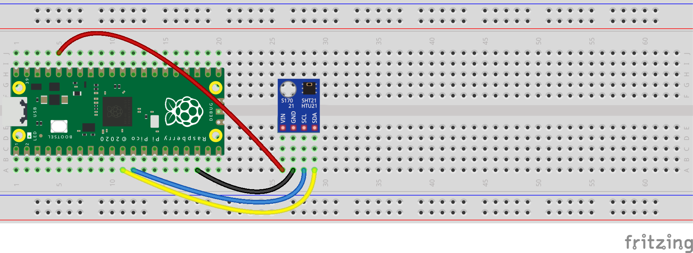

# pico-htu21d

This is a MicroPython library for the Raspberry Pi Pico and the 
[HTU21D](https://www.te.com/usa-en/product-CAT-HSC0004.html) Digital Relative Humidity sensor with Temperature output.

## Example
```python
from machine import Pin, I2C
from utime import sleep

from htu21d import HTU21D

i2c0_sda = Pin(8)
i2c0_scl = Pin(9)
i2c0 = I2C(0, sda=i2c0_sda, scl=i2c0_scl)

htu21d = HTU21D(0x40, i2c0)

while True:
    measurements = htu21d.measurements
    print(f"Temperature: {measurements['t']} °C, humidity: {measurements['h']} %RH")
    sleep(1)
```
`measurements` is a dictionary that contains the following values:

| Field       | Description                                                                                    |
|-------------|------------------------------------------------------------------------------------------------|
| t           | The temperature (°C)                                                                           |
| t_dew_point | The temperature at which the water vapor in the air becomes saturated and condensation begins  |
| t_crc_ok    | The result of the Cyclic Redundancy Check of the temperature (True, False or None if disabled) |
| t_adc       | The 'raw' temperature value as produced by the sensor                                          |
| h           | The relative humidity (%RH)                                                                    |
| h_crc_ok    | The result of the Cyclic Redundancy Check of the humidity (True, False or None if disabled)    |   
| h_adc       | The 'raw' humidity value as produced by the sensor                                             |

This is the circuit for the example code above. It uses the 
[GY-21 HTU21](https://www.az-delivery.de/en/products/gy-21-temperatur-sensor-modul) breakout board.



## Customizing configuration
The default settings use a 12 bits resolution for the relative humidity and a 14 bits resolution for the temperature.
The heater is disabled and the measurements include the CRC results.

The next example uses a customized configuration:
```python
from htu21d import HTU21D, HTU21DConfiguration

config = HTU21DConfiguration()
config.measurement_resolution = HTU21DConfiguration.RH_8_T_12_BIT
config.heater_enabled = True
config.crc_enabled = False

htu21d = HTU21D(0x40, i2c0, config)
```